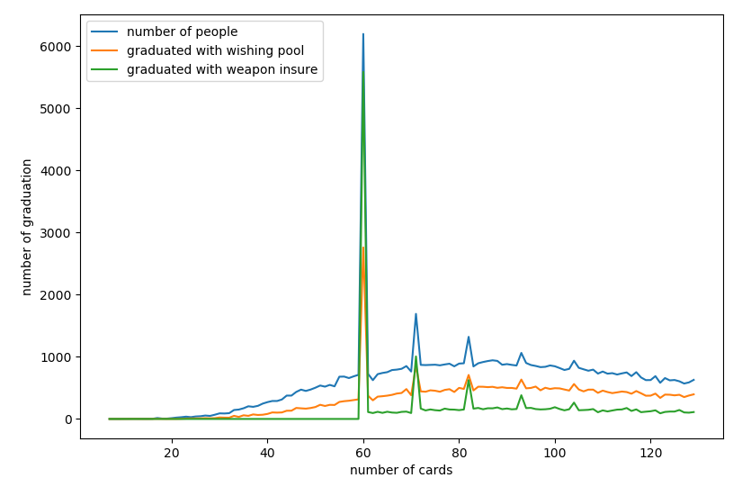

# 崩坏3 抽卡概率模拟器
#### 啊，想起抽卡都来气~~ 让我们试试这个概率有多坑爹..

毕业指包括圣痕和武器毕业，计算了10次保底、武器60次保底以及许愿池功能。 
国服机制有点特殊，分为公示概率和非保底概率（如果传闻没错）。即**十连保底+非保底概率=公示概率**。 
所以内有一份pro_geter.py用于暴力计算非保底概率。

*  以下是模拟一万次抽卡的毕业人数占比（可理解为毕业概率）：
10抽毕业的人数占比: 4e-05（有5个天选之人）

20抽毕业的人数占比: 0.00056

30抽毕业的人数占比: 0.00518

40抽毕业的人数占比: 0.02294

50抽毕业的人数占比: 0.06271

60抽毕业的人数占比: 0.18014

70抽毕业的人数占比: 0.25579

80抽毕业的人数占比: 0.35117

90抽毕业的人数占比: 0.44557

100抽毕业的人数占比: 0.53354（人均水准）

110抽毕业的人数占比: 0.61389

120抽毕业的人数占比: 0.68414

130抽毕业的人数占比: 0.74554

140抽毕业的人数占比: 0.79669

150抽毕业的人数占比: 0.83903

160抽毕业的人数占比: 0.87476

170抽毕业的人数占比: 0.90321

180抽毕业的人数占比: 0.92514

190抽毕业的人数占比: 0.94292

200抽毕业的人数占比: 0.95669

下面是抽卡图，算是比较平稳...  

（横轴是抽卡的数量，蓝线是该抽卡数量的毕业人数，橙线是用了许愿池毕业的，绿色线是吃了武器保底的） 
里面在60抽时有个突出的部分就是武器保底，说明武器保底和许愿池确实拯救了不少非洲人... ...  

总体来说一般人都在100发左右毕业，一发28元，真不是贫民和非洲人玩得起的...
