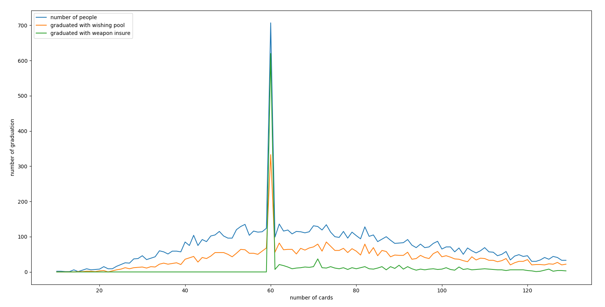

# 崩坏3 抽卡概率模拟器
#### 啊，想起抽卡都来气~~ 让我们试试这个概率有多坑爹..

毕业指包括圣痕和武器毕业，计算了10次保底、武器60次保底以及许愿池功能。

*  以下是模拟一万次抽卡的毕业人数占比（可理解为毕业概率）：
> 10抽毕业概率: 0.0002  
> 20抽毕业概率: 0.0048  
> 30抽毕业概率: 0.029  
> 40抽毕业概率: 0.0835  
> 50抽毕业概率: 0.1787  
> 60抽毕业概率: 0.3545  
> 70抽毕业概率: 0.4708  
> 80抽毕业概率: 0.5828  
> 90抽毕业概率: 0.6788  
> 100抽毕业概率: 0.756  
> 110抽毕业概率: 0.8188  
> 120抽毕业概率: 0.8673  
> 130抽毕业概率: 0.9017  
> 140抽毕业概率: 0.9277  
> 150抽毕业概率: 0.9487  
> 160抽毕业概率: 0.9644  
> 170抽毕业概率: 0.9752  
> 180抽毕业概率: 0.9829  
> 190抽毕业概率: 0.9885  
> 200抽毕业概率: 0.992  

下面是抽卡图，算是比较平稳...  

（横轴是抽卡的数量，蓝线是该抽卡数量的毕业人数，橙线是用了许愿池毕业的，绿色线是吃了武器保底的） 
里面在60抽时有个突出的部分就是武器保底，说明武器保底和许愿池确实拯救了不少非洲人... ...  

总体来说一般人都在100发左右毕业，一发28元，真不是贫民和非洲人玩得起的...
